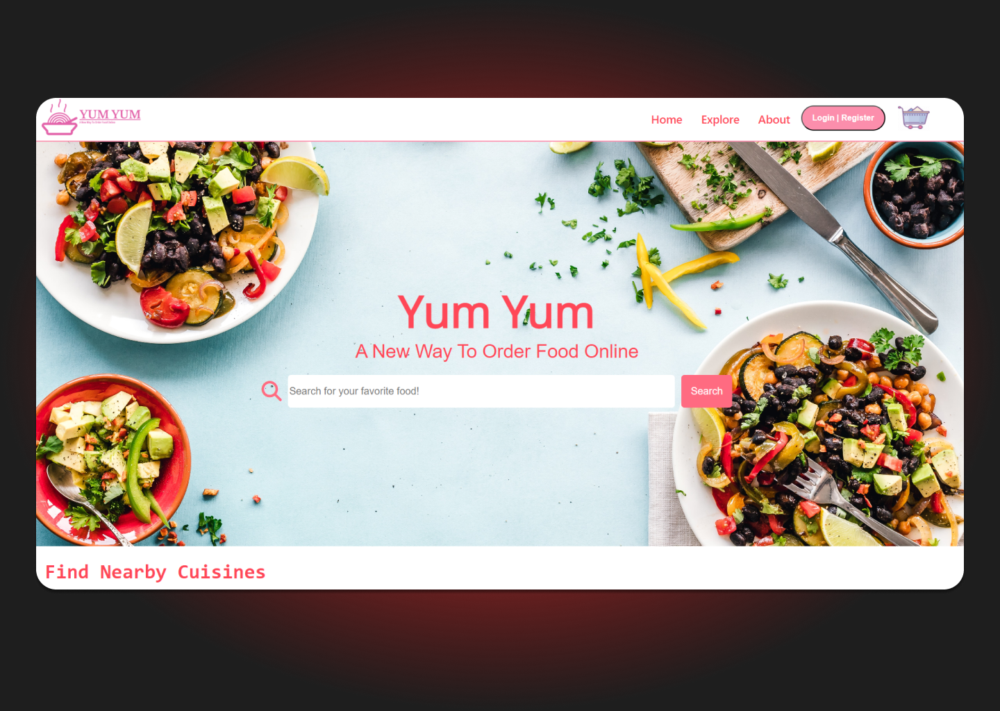

# Yum Yum : A New Way To Order Food Online

## Introduction

Yum Yum is an online food ordering web-based platform that allows customers to order food from various restaurants and have it delivered to their doorstep. The system typically includes features such as searching and browsing through restaurant menus, adding and removing items from a cart, checking out and placing orders for delivery, tracking the status of orders, and reviewing and rating restaurants and food items. The system will be build using a variety of technologies, such as Node.js, Express.js, MongoDB, UI libaries as well as HTML, CSS, and JavaScript.

## Technology Stack

- 
- 
- 
- 
- 
- 

<!-- CONTRIBUTING -->

## Contributing

Contributions are what make the open source community such an amazing place to learn, inspire, and create. Any contributions you make are **greatly appreciated**.

If you have a suggestion that would make this better, please fork the repo and create a pull request. You can also simply open an issue with the tag "enhancement".
Don't forget to give the project a star! Thanks again!

1. Fork the Project
2. Create your Feature Branch (`git checkout -b feature/AmazingFeature`)
3. Commit your Changes (`git commit -m 'Add some AmazingFeature'`)
4. Push to the Branch (`git push origin feature/AmazingFeature`)
5. Open a Pull Request

## License

Distributed under the MIT License. See `LICENSE` for more information.
